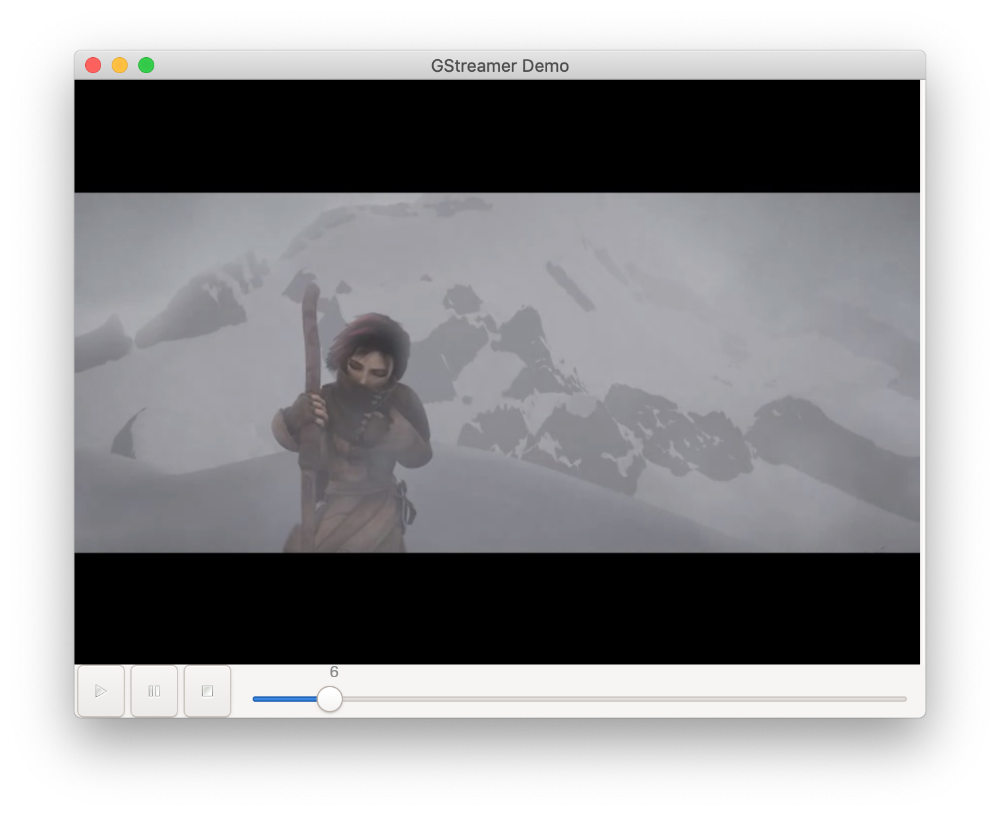

=====================
scalanative-gstreamer
=====================

Scala Native bindings to `GStreamer <https://gstreamer.freedesktop.org>`_.

**WARNING**: WIP - the bindings are very incomplete and subject to change at any time!

Prerequisites
=============

Make sure you have the following dependencies installed:

* GStreamer (gstreamer-1.0)
* pkg-config, make & C toolschain must be in your PATH
* for the example app: gst-plugins-base, gst-plugins-good

The bindings require some C helper code to be compiled. This will be handled automatically by the `sbt-nbh <https://github.com/jokade/sbt-nbh>`_ plugin. However, make sure that ``pkg-config --cflags gstreamer-1.0`` works and returns without errors (a common error is that one of ``.pc`` files is not on the ``PKG_CONFIG_PATH``).

Example
=======

The example in `demo/src/main/scala/ <demo/src/main/scala/>`_ is a (incomplete) port of the `GStreamer Tutorial "GUI toolkit integration" <https://gstreamer.freedesktop.org/documentation/tutorials/basic/toolkit-integration.html?gi-language=c>`_.

Run it with:

.. code::

  sbt demo/run

  
